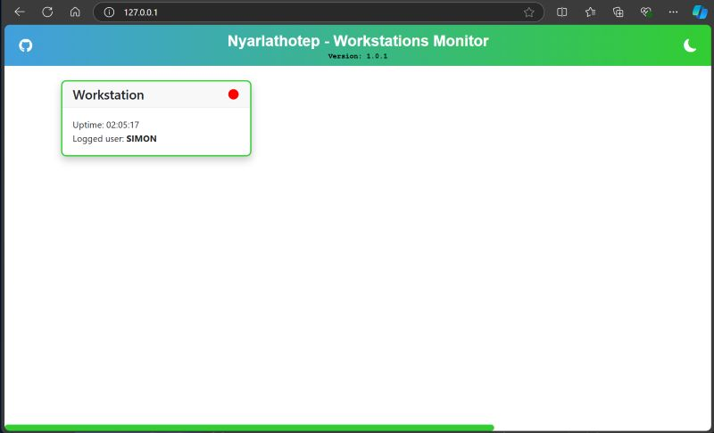
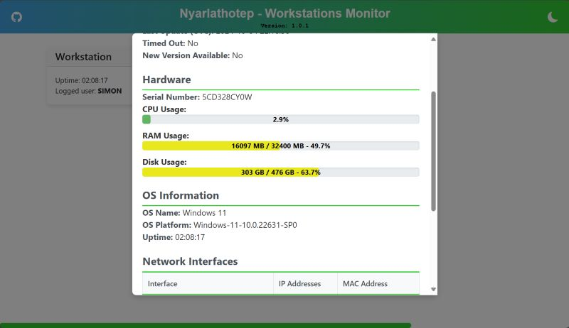

# Nyarlathotep
Web remote workstations monitor 

## Description
This is a simple client, server (web) workstations monitor.

## Client aka Agent
It's a python application actually written for windows (will be os Independent)

## Backend Server
Backend server is a flask web server with 2 routes:

- `/client_update` that waits for a POST with the JSON file from the client.
- `/workstations_status` that is an api that return all the workstations information in a JSON array

## Frontend 
Frontend is written using node js, typescript and Svelte framework. 
It requests the `workstations_status` from the backend and does all the presentation

## Screenshots

